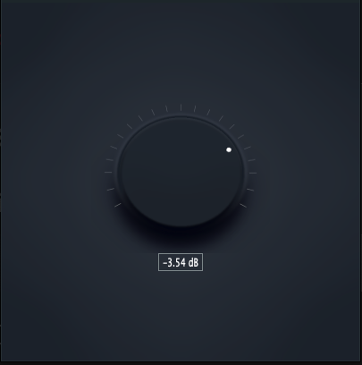

## Gain Plugin

This plugin is the first of a series of simple plugins designed to help me become more and more familiar with Plugin Development and DSP fundamentals.

It's a simple knob that changes the gain of an input signal. It can be used as a  Standalone or a AU, VST, AAX plugin.

The visuals are inspired by Altiverb's knob design. I'm not monetizing this, and it is in no way comparable to the great job that the engineers at AudioEase have done... so please dont sue me.

It was a really fun project to learn to build, specially with regards to the Knob Strip. It was the first I ever heard of such a concept, but the visual results speak for themselves.

Have a look:

